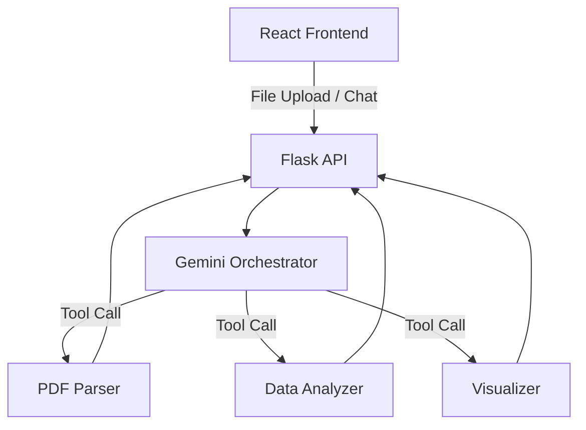

# LedgerMind AI — Autonomous Financial Intelligence

## Overview
LedgerMind AI is an intelligent, agentic workflow system designed to automate financial data processing for small businesses, startups, and freelancers. Rather than simply acting as a conversational chatbot, it utilizes a Gemini-powered autonomous agent to reason about user input, detect data types, parse complex documents (including PDF bank statements), detect financial anomalies, and generate insights.

## Project Architecture

### 🧠 Agentic Workflow
The core of LedgerMind AI is its agentic orchestration. The agent dynamically decides which backend Python tools to call based on the context of the uploaded data or the user's natural language queries.



### ⚙️ Backend Tools (Flask + Python)
The backend is highly modular, breaking down the agent's capabilities into specific, callable tools:
- **`orchestrator.py`**: The "brain" of the application. It receives inputs, constructs prompts for the Gemini model, and translates the LLM's structured outputs into direct function calls against our Python tools.
- **`pdf_parser.py`**: Extracts transaction tables from PDF bank statements using `pdfplumber`, with a fallback to `pytesseract` for OCR on scanned, image-based documents.
- **`data_parser.py`**: Standardizes inconsistent CSV and Excel exports into a clean, predictable Pandas DataFrame schema.
- **`analyzer.py`**: Runs statistical analysis (like Z-score anomaly detection) to identify unusual spending spikes and outliers.
- **`visualizer.py`**: Generates Matplotlib charts based on Pandas data and returns them as embeddable base64 images to the chat UI.
- **`report_generator.py`**: Compiles the entire session's findings into a polished, downloadable PDF report.

### 💻 Frontend Components (React + Vite)
The frontend is built with a premium, minimal aesthetic, utilizing pure CSS to ensure a clean user experience.
- **`Dashboard.jsx`**: A persistent view that displays high-level statistics, total spending, and dynamically lists flagged anomalies.
- **`Chat.jsx`**: An interactive chat interface that renders not only the final answers but also the agent's intermediate "thoughts" and tool calls in real-time, making the agentic reasoning completely transparent.
- **`Uploader.jsx`**: A streamlined drag-and-drop file ingestion point.

## Workflow Images


## Setup & Installation

### Prerequisites
- Python 3.9+
- Node.js 18+
- Tesseract OCR (installed at the system level for PDF fallback)
- Gemini API Key

### Backend Setup
```bash
cd backend
python -m venv venv
source venv/bin/activate  # On Windows use `venv\Scripts\activate`
pip install -r requirements.txt
# Add .env file with GEMINI_API_KEY=your_key
flask run

```
OR
cd "C:\Users\123\Desktop\LedgerMind AI\backend"
python app.py

### Frontend Setup
```bash
cd frontend
npm install
npm run dev
```
